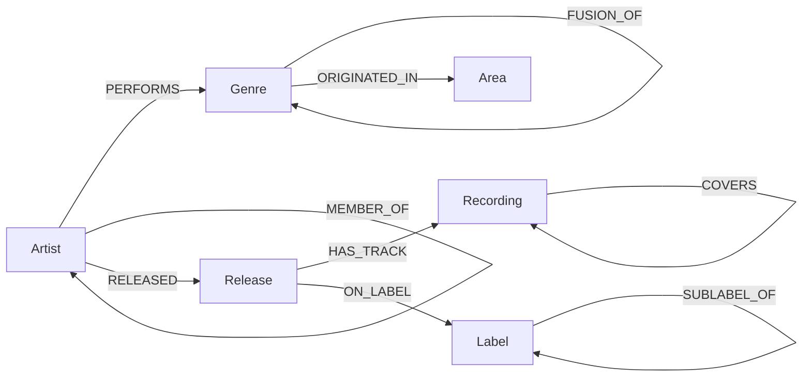

# Review — Yoga Harishini Paladugu's repos, and how to turn them into a `music-kg`

Reviewed 5 Aug 2026 against `github.com/samyama-ai/*-kg`.

Repos reviewed: [IProject2](https://github.com/yogapaladugu-bot/IProject2) ·
[IProject3](https://github.com/yogapaladugu-bot/IProject3) ·
[Repo-1](https://github.com/yogapaladugu-bot/Repo-1) ·
[Project](https://github.com/yogapaladugu-bot/Project)

---

## 1. Where things stand

| Repo | Contents | Verdict |
|---|---|---|
| **IProject3** | `index.html`, `style.css`, `script.js` (351 lines) — vis-network genre graph, **50 nodes / 72 edges**, hand-authored | The real project. Working, and the instinct behind it is right. |REVIEW.
| **IProject2** | `Notes.md`, `Parity Matrix.md`, `Publicly accessible URLs.md` | Genuinely good written work. The parity matrix is the standout. |
| **Repo-1**, **Project** | Empty (README only, 8 and 9 bytes) | Delete them. Empty repos on a profile read as abandoned work. |

### What's actually good here

Three things, and they're not small:

1. **She picked the right primitive without being told to.** Asked to explore knowledge graphs, she didn't build a list of genres — she built a graph where the *edges carry the meaning*. Her edge titles are the best part of the whole project: *"Blues provided the foundation for chords in rock music"*, *"Neo soul infuses traditional soul music with complex jazz harmonies, extended chords, and smoky textures."* That is exactly what a knowledge graph is for, and most people don't get there on their first try.
2. **The Parity Matrix is professional-grade.** A 6-dimension feature comparison of her own work against two reference apps, written honestly — including where hers is thinner. That document is more impressive than the code.
3. **She debugs conceptually.** `Publicly accessible URLs.md` correctly explains *why* ngrok differs from Netlify (tunnel vs. hosting, not just "one is temporary"). She answered the question that was actually asked.

### The one structural problem

Every fact in the graph is typed by hand, inline, in `script.js`. 50 nodes is the ceiling of what a person can hand-curate. **Every `-kg` repo in `samyama-ai` is defined by the opposite move: a public dataset + a loader.** `imdb-kg` is 1.94M nodes not because someone typed harder, but because `etl/loader.py` reads IMDB's TSVs.

That is the single gap between IProject3 and a `-kg` repo, and it's a solvable one. The graph modelling is already done — she just needs to point it at real data.

Also still outstanding from 12 July: **there is no public URL.** It was asked for twice, she wrote a correct explanation of how to do it, and it hasn't happened. That's the first thing to close.

---

## 2. Public data sources (the main ask)

Ordered by *what you can actually get done first*, not by size. License matters — every `-kg` repo names its source and license in the README.

### Tier 1 — start here. No big downloads, results the same day.

**① Wikidata SPARQL** — CC0, no key, no download, query in a browser.
This is the direct upgrade to what she already built. Her 50 hand-typed genre nodes become ~2,000 sourced ones, each with a citation.

Paste into [query.wikidata.org](https://query.wikidata.org):

```sparql
SELECT ?genre ?genreLabel ?parent ?parentLabel ?inception ?countryLabel
WHERE {
  ?genre wdt:P31/wdt:P279* wd:Q188451 .      # anything that is a music genre
  OPTIONAL { ?genre wdt:P279  ?parent }      # subgenre-of  → her edges
  OPTIONAL { ?genre wdt:P571  ?inception }   # inception    → her "year" field
  OPTIONAL { ?genre wdt:P495  ?country }     # origin country
  SERVICE wikibase:label { bd:serviceParam wikibase:language "en" }
}
```

Download as JSON, commit it as `data/genres.json`, commit the query as `queries/genres.rq`. Useful properties: `P136` genre, `P279` subclass of, `P737` influenced by, `P361` part of, `P463` member of, `P264` record label.

**② MusicBrainz** — core DB is **CC0**, ~2,000 genres at [musicbrainz.org/genres](https://musicbrainz.org/genres), plus a JSON API (1 request/sec, no key).
The relationship tables are the prize: artist↔artist (*member of band*, *collaboration*, *teacher*), and recording↔recording (**`samples material`**, *cover*). A sampling graph — who sampled whom — is one of the most interesting graphs in music, and MusicBrainz is the only open source for it (WhoSampled has no open API).

**③ AcousticBrainz** — **CC0**, [acousticbrainz.org/download](https://acousticbrainz.org/download).
7.5M recordings with BPM, key, scale, mood and genre classifiers, keyed by MusicBrainz ID. Collection stopped in 2022 but the dumps are still up and still free.
**This matters:** Spotify killed `/audio-features`, `/audio-analysis` and `/recommendations` in Nov 2024 and blocked them for any app approved after 27 Nov 2024. There is still no replacement 18 months later. AcousticBrainz is now the best open substitute — and it joins to MusicBrainz on MBID for free.

### Tier 2 — real scale. This is the `imdb-kg` equivalent.

**④ MusicBrainz full dumps** — `mbdump.tar.bz2`, **CC0**, [metabrainz.org/datasets](https://metabrainz.org/datasets/download).
Artists, releases, recordings, labels, works, areas, and the `l_artist_artist` link table. This is the IMDB of music. Large (tens of GB) — subset it the way `imdb-kg` does with `--min-votes` / `--max-titles`.

**⑤ Discogs monthly XML dumps** — [data.discogs.com](https://data.discogs.com).
Artists, labels, releases, masters. Two things Discogs has that nobody else does: **`styles`** (much finer-grained than genre — the actual vocabulary scene people use) and **label→sublabel hierarchy**, which gives a label-lineage graph. Check the current license terms on the page before publishing derived data.

**⑥ ListenBrainz dumps** — CC0. Real listening events → a co-listening graph ("people who listen to X also listen to Y"). This is the edge type that *cannot* be hand-authored, and it's how you'd validate whether her hand-drawn influence edges match real behaviour.

### Tier 3 — audio and ML, if she wants to go that direction

**⑦ FMA — [github.com/mdeff/fma](https://github.com/mdeff/fma)**. 106,574 Creative Commons tracks, 16,341 artists, and — the useful bit — a **hierarchical taxonomy of 161 genres shipped as a CSV**. That taxonomy alone is a ready-made, citable replacement for her hand-drawn hierarchy, and it's a small download even if you skip the 917 GiB of audio.

**⑧ MTG-Jamendo** — 55k CC tracks tagged with 195 genre/mood/instrument tags.
**⑨ Million Song Dataset + Last.fm tags** — 1M tracks, tag co-occurrence. 2011-vintage, but small subsets and a well-trodden path.

### Tier 4 — the angles that would make it *distinctive*

Everyone builds a Western-pop genre graph. These don't exist yet as open KGs:

**⑩ Carnatic & Hindustani — [CompMusic / Dunya](https://dunya.compmusic.upf.edu) and the [Saraga dataset](https://mtg.github.io/saraga/) (MTG-UPF).**
Raga, tala, and *guru-shishya parampara* — teacher-to-student lineage. Raga has a genuine hierarchy (72 melakarta → janya ragas) that is a far better graph than "pop → indie pop", and lineage chains are exactly the kind of multi-hop query a graph engine wins at and SQL loses at. Given her background and Samyama's, this is the highest-upside idea in this document.

**⑪ [Setlist.fm API](https://api.setlist.fm)** — free key. What artists *actually played live*: artist→song→venue→tour. Nobody has this as a graph.
**⑫ [SecondHandSongs API](https://secondhandsongs.com/page/API)** — covers, versions and originals. A cover-version graph.
**⑬ [Genius API](https://docs.genius.com)** — free key; per-song samples/interpolations relationships. No bulk export, so use it to enrich, not to build.

### Do not build on these

| Source | Why not |
|---|---|
| **Spotify Web API** audio-features / audio-analysis / recommendations | Deprecated Nov 2024, hard-blocked for new apps. A project built on it can't be reproduced by anyone reading the repo. |
| **Every Noise at Once** | Frozen since 2023, Spotify-derived, no license. Cite it as inspiration; don't scrape it. |
| **AllMusic, Rate Your Music** | ToS forbid scraping. Great for reading, unusable as a source. |

---

## 3. Proposal: `music-kg`

Rename `IProject3` → `music-kg` and give it the standard `-kg` layout. Every repo in `samyama-ai` has the same shape, and matching it is half the credibility:

```
music-kg/
├── README.md              # schema, node/edge counts, data source + license, 2 killer queries
├── GETTING_STARTED.md     # prereqs → docker run → load → first query
├── LICENSE                # Apache 2.0
├── data/
│   ├── genres.json        # Wikidata SPARQL export  (generated, not typed)
│   └── curated_edges.json # HER hand-written influence edges — keep these!
├── queries/genres.rq      # the SPARQL that produced data/genres.json
├── etl/loader.py          # data/ → Samyama graph
├── docs/100-queries.md    # Cypher showcase
├── mcp_server/server.py   # so Claude can query it in English
├── web/                   # the vis-network front-end, now reading data/*.json
└── tests/test_loader.py
```

**Keep the hand-written edges.** They are provenance-carrying human judgement that no public dataset contains, and they're the most original thing in the project. They become `data/curated_edges.json` with a `source: "curated"` property, sitting alongside `source: "wikidata"` edges. Being able to query *"show me influence paths that Wikidata missed"* is a genuinely nice result.

### Schema sketch



### Two queries that justify the graph

`imdb-kg` leads its README with one query that SQL can't do well — director-actor power pairs. `music-kg` needs its own. Two candidates:

```cypher
-- 1. Latent fusion: genre pairs that share many artists but have NO edge between them.
--    These are fusions waiting to be named.
MATCH (g1:Genre)<-[:PERFORMS]-(a:Artist)-[:PERFORMS]->(g2:Genre)
WHERE g1.name < g2.name AND NOT (g1)-[:INFLUENCED|SUBGENRE_OF]-(g2)
RETURN g1.name, g2.name, count(a) AS shared_artists
ORDER BY shared_artists DESC LIMIT 10
```

```cypher
-- 2. How did we get from Gospel to Hyperpop? Multi-hop lineage; a JOIN can't express this.
MATCH p = shortestPath((:Genre {name:'Gospel'})-[:INFLUENCED*..8]->(:Genre {name:'Hyperpop'}))
RETURN [n IN nodes(p) | n.name] AS lineage
```

Then run betweenness centrality (Samyama ships 14 graph algorithms) to find the **bridge artists** — the ones connecting otherwise-separate genre communities. That result is a blog post on its own.

### Milestones

| Week | Deliverable |
|---|---|
| **0** | Deploy the *current* site to Netlify. Put the URL in the README. Close the open item. |
| **1** | Wikidata SPARQL → `data/genres.json`. Front-end `fetch()`es it instead of hard-coding. 50 nodes → ~2,000. |
| **2** | `etl/loader.py`; load into `samyama-graph` via Docker; 20 Cypher queries in `docs/`. |
| **3** | MusicBrainz artist↔genre and artist↔artist; run the two queries above; write up what you found. |
| **4** | `mcp_server/` so Claude answers music questions from the graph. README with counts + screenshot. |

---

## 4. Code review — IProject3

Concrete, in priority order.

1. **`script.js:7-8` + `:119` — the localStorage bug.** `savedNodes` permanently shadows `OGnodes`. Once a visitor adds one genre, they will *never* see any curated data you add afterwards — your updates are invisible to everyone who ever used the Add button. Fix: keep only *user additions* in localStorage and merge them onto `OGnodes` at load, or version the cache key (`nodes_v3`).
2. **`script.js:326-341` — XSS.** User text from the Add form goes straight into `innerHTML`. Anyone can type `` as a genre name. Use `textContent`, or build the elements. Worth fixing precisely because it's what a reviewer looks for first.
3. **`script.js:233` — `const id = nodes.get().length + 2`.** Length ≠ max id. It survives today by luck; it collides the moment anything is removed. Use `Math.max(...nodes.getIds()) + 1`.
4. **`script.js:222-229`** — if `pick.value` matches no node, `parentID` stays `null` and an edge to `null` is silently added. Guard and show an error.
5. **`index.html:7`** — unpinned CDN (`vis-network/standalone/...`). Pin `vis-network@9.1.9` or the site breaks on their next major release, with no commit from you.
6. **37 of 50 nodes have `"title": ""`** — so hovering most nodes shows nothing, which contradicts what the Parity Matrix claims the site does. Either fill them in or generate them from `description`.
7. **`index.html:6`** — title says `Music Genred`. **`:11`** — `<center>` was deprecated in HTML 4.01; use CSS.
8. **Separate data from code.** Move `OGnodes`/`OGedges` out of `script.js` into `data/genres.json` and `fetch()` them. This one change is what turns a webpage into a dataset — and it's the prerequisite for everything in §3.
9. Add `.gitignore` and `LICENSE` (Apache 2.0, same as the `-kg` repos).

## 5. Repo hygiene

- **Rename.** `IProject2`/`IProject3`/`Repo-1`/`Project` say nothing on a resume. → `music-kg` and `internship-notes`. GitHub keeps redirects, so renaming is safe.
- **Delete** `Repo-1` and `Project`.
- **Every README needs**: one-line description, live URL, a screenshot or GIF, data source + license, and how to run it locally. Compare against the `imdb-kg` README — that's the bar.
- Move `IProject2`'s three docs into `internship-notes/` with an index, and add the mermaid diagrams that were asked for on 8 July.

---

## What to say to her

Lead with the parity matrix and the edge descriptions — those are real, and she should know it. Then one sentence for the pivot: *"You've done the hard part, which is deciding what the nodes and edges mean. Now stop typing the data and let a loader fetch it — start with the Wikidata query in §2, it'll take your graph from 50 nodes to 2,000 in an afternoon."*

And the Carnatic/raga angle (§2 ⑩) is worth floating. It's the one where she'd be building something that doesn't already exist.
